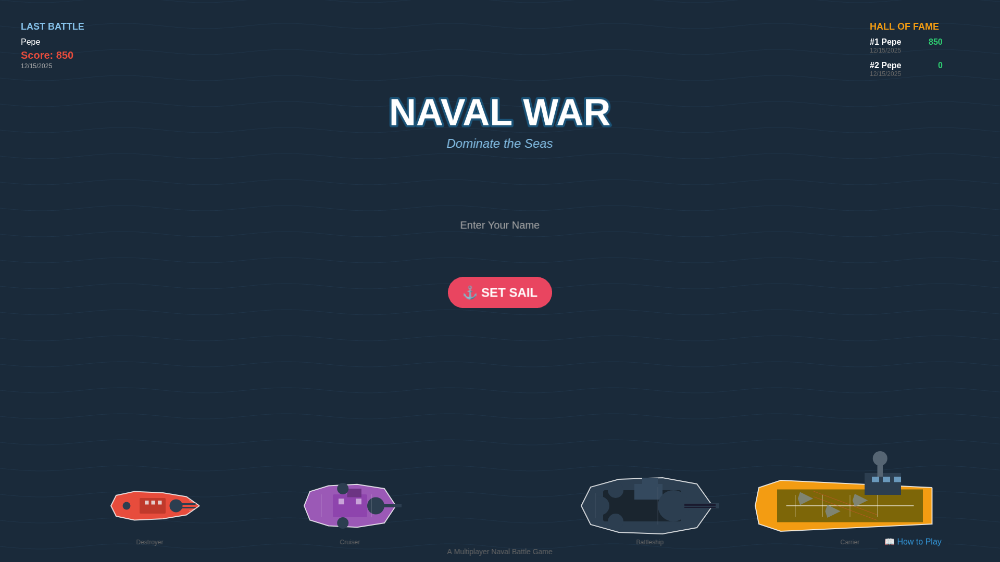
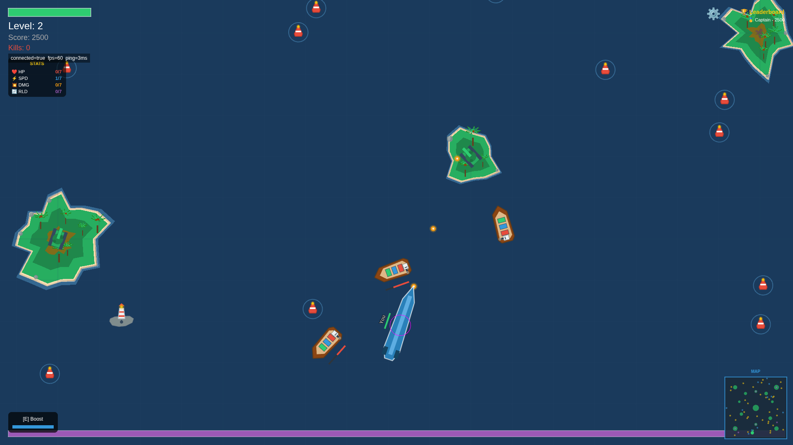
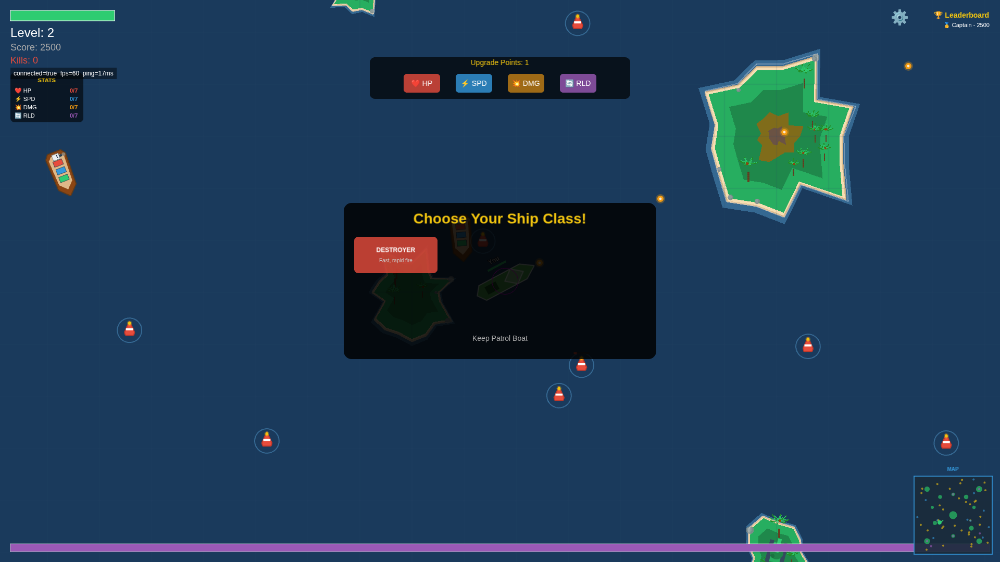
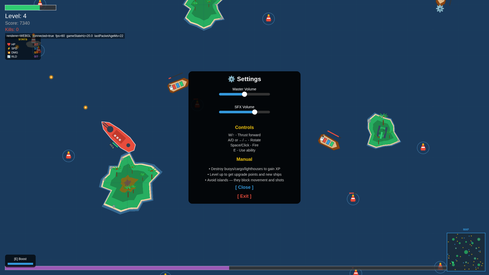
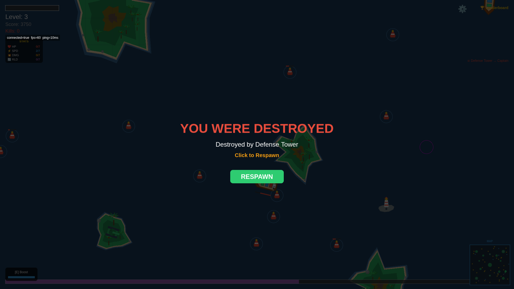

# Naval War

**Play Now:** [https://naval-war-game-57170897-7fac0.web.app](https://naval-war-game-57170897-7fac0.web.app) | **Manual:** [Read the Guide](https://naval-war-game-57170897-7fac0.web.app/manual.html)

A browser-based single-player tactical naval combat game. Command your ship, destroy enemies, upgrade your fleet, and climb the leaderboard.

---

### 1. Start Your Campaign
Enter your name and set sail.


### 2. Tactical Combat
Destroy buoys, cargo ships, and hostile tanks to gain XP.


### 3. Upgrade & Evolve
Level up to unlock new ships (Destroyer, Cruiser, Battleship, Submarine, Carrier) and boost your stats.


### 4. Customize & Control
Adjust settings and view controls.


### 5. Leaderboard
Survive as long as you can. Your best scores are saved to the Hall of Fame.


---

## Features
- **Roguelite Progression:** Level up to unlock ships and upgrades in a single run.
- **6 Ship Classes:** Patrol Boat to Aircraft Carrier, each with unique abilities (Shield, Boost, Drone, Stealth).
- **Hostile AI:** Battle against Auto-Targeting Tanks and Defensive Lighthouses.
- **Local Persistence:** High scores and last game stats are saved locally.

## Development
```bash
git clone https://github.com/isanjary/Naval-War-Game.git
cd Naval-War-Game
npm install
npm run dev
```

## License
MIT License. Developed by [isanjary](https://github.com/isanjary).
